## Abhishek Soni

### 🍳 Skill Distribution

### 📊 Professional Work
* Med Mutual - A webapp to facilitate medical insurance
	* Spring Boot
 	* Angular
* Integration Enablement Kit - A webApp to perform 2fa
	* Spring Boot
	* Tapestry
	* Struts
	* HTML/CSS
* Construct Secure - A webApp for construction workflow
	* Spring Boot
	* Java
* Aircore - A passenger service system webApp
	* Struts
	* Core Java
	* HTML
	* Linux

### 👨🏼‍🎨 Hobby Projects
* JustThese - A webapp for habit building
* TicTacToe - A cli game
* OnTime - A timetable webapp written using Django
* CmdTodo - A cli todo app
* MqCount - A cli utility to count active connections

### 🎩 Achivements
* LLD Design Skills - 2nd Place - 2023
* Most Innovative Project - 2021
* Spot Award - 2019
* Excellence Award - 2017

### 📖 Education
* BE Computer Science, MITCOE, Pune

---

```mermaid
mindmap
    id(For the ❤️ of Engineering)
```

